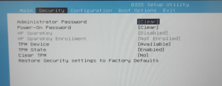
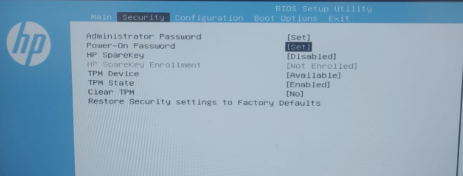
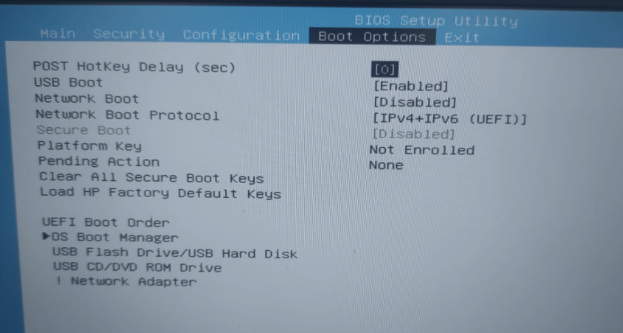
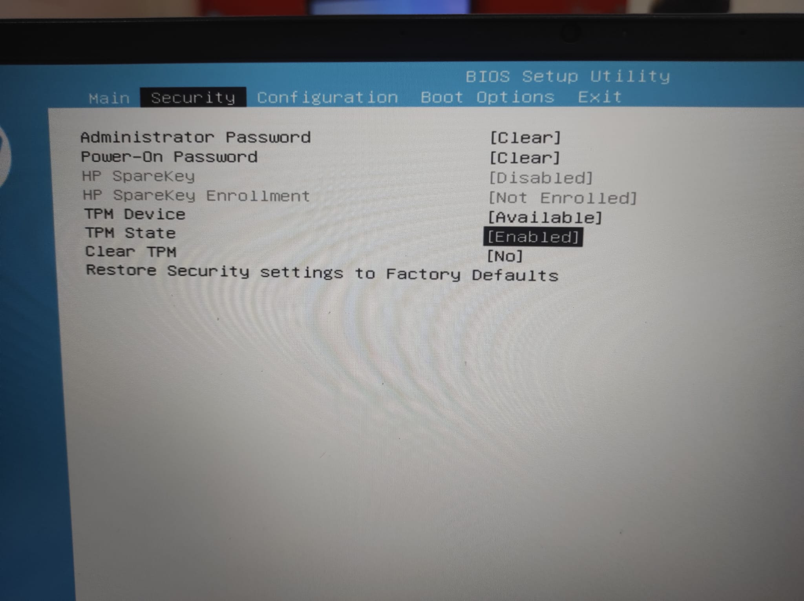

author: Pablo Painceiras Martinez
summary: En este codelab quedan expuestos diferentes mecanismos de protección de BIOS/UEFI.
id: BIOS/UEFI
categories: codelab,markdown,BIOS,cybersecurity
environments: Web
status: Published
feedback link:
analytics account: ID de Google Analytics

## Proyecto-1.1-Bationado

En este proyecto vamos a describir como hacer una configuración segura de la BIOS/UEFI de un portátil HP.

¿Qué es la BIOS?

La BIOS (Basic Input/Output System, o Sistema Básico de Entrada/Salida) es un software que se ejecuta en un chip ubicado en la placa madre de una computadora. Es el primer software que se ejecuta al encender la máquina y su principal función es iniciar y probar el hardware del sistema, como el procesador, la memoria RAM, el disco duro, la tarjeta de vídeo, entre otros.

Antes de empezar tendremos que saber como entrar el la BIOS.

Para entrar en la BIOS del propio ordenador introducimos el siguiente comando en Windows Powershell en modo administrador. Esto reinicia el ordenador y al arrancar te introduce en la BIOS

shutdown /r /fw /t 0  

Una vez al entrar en el menú principal de la BIOS presionamos la tecla F10 para entrar en la BIOS Setup

Una vez entrado, nos movemos a la sección de “Security”, en donde podemos encontrar la contraseña del administrador (Administrator Password) y del arranque (Power-On Password).

Nos situamos donde pone “Clear” en cada uno de los dos, unas vez encima, pulsamos “ENTER” y ponemos una contraseña.

Luego nos movemos a “Boot Options”, en donde podemos encontrar las opciones de arranque.

Nos fijaremos en USB Boot, la cual deshabilitaremos para impedir que el sistema pueda hacer el arranque a través de un USB o dispositivo de memoria externa.

Por otro lado, en este caso ya esta deshabilitada la opción de arranque por una red, pero si esta activa la desactivaríamos

Una vez realizado las acciones anteriores se quedaran de la siguiente forma.

El orden de prioridades solo tendrá un tipo de arranque, ya que los demás están inactivos

A continuación, habilitaremos el Secure Boot. De normal esta inaccesible, para poder acceder a él tendremos que restaurar las HP Factory Default Keys.

Una vez restauradas nos permitirá acceder al Secure Boot, el cual habilitaremos. Esto garantizar que el sistema arranque únicamente utilizando software que sea considerado confiable.

A continuación volveremos a la pestaña “Security” en donde habilitaremos el TPM, esto nos proporcionara múltiples capacidades relacionadas con la seguridad, y su propósito es mejorar la integridad y la seguridad de un sistema informático. Para ello habilitaremos el TPM Device y el TPM State.

